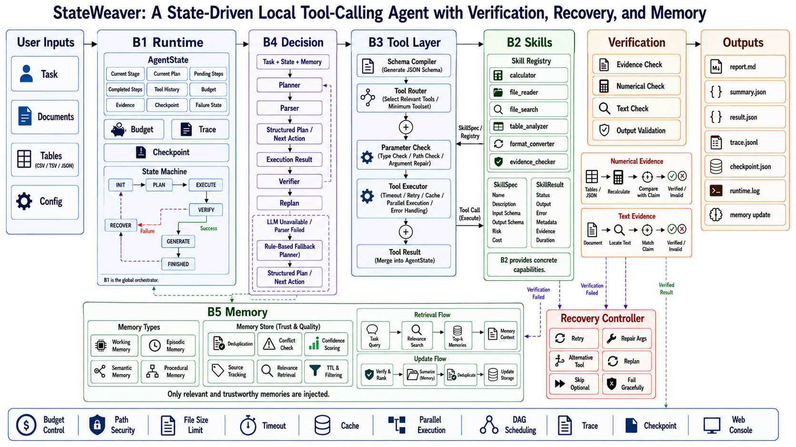
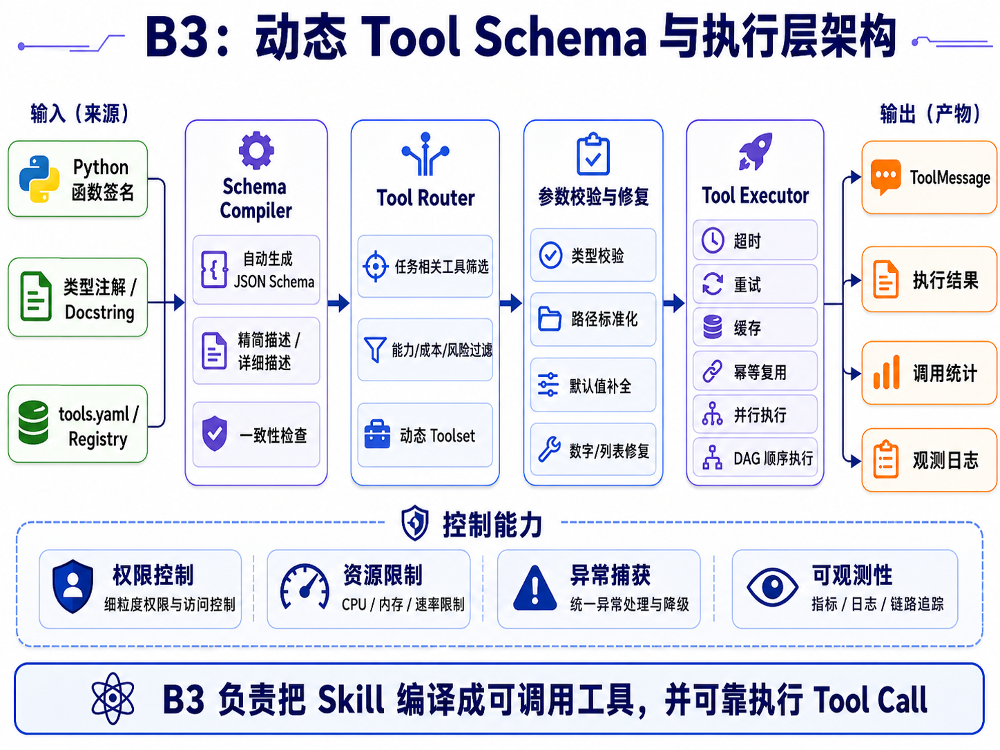
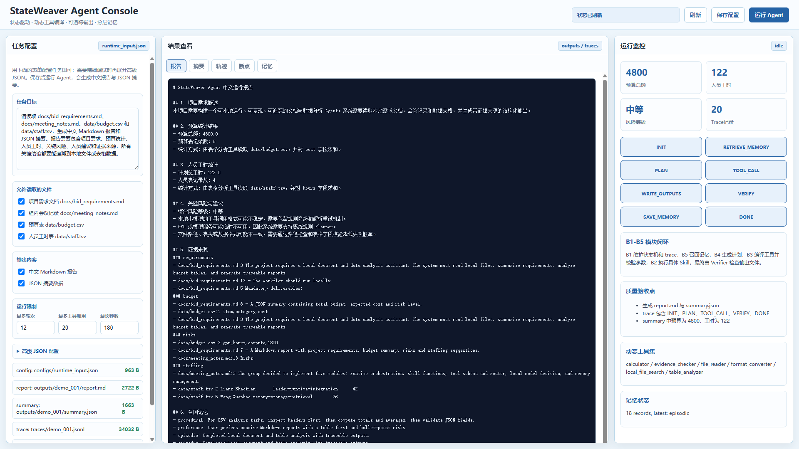

# 个人模块 README - B3 动态 Tool Schema 与执行层

> 本 README 对应东北大学人工智能 2023 级自然语言处理实训第 16 组，本人负责 B3 动态 Tool Schema 与执行层的测试验证、Schema 核对、参数异常用例和执行日志检查。

---

## 1. 模块概述

### 1.1 模块名称

`B3 动态 Tool Schema 与执行层（Dynamic Tool Schema & Execution Layer）`

### 1.2 模块说明

B3 模块位于 B4 Decision（决策规划）与 B2 Skills（技能工具）之间，是模型调用接口与真实 Python 技能之间的桥梁。它的核心职责是：

1. **将 Skill 编译为模型可理解的 Tool Schema**：读取 B2 中注册的 `SkillSpec`（含函数签名、类型注解、参数说明），生成标准 JSON Schema 供本地模型调用。
2. **根据任务动态筛选工具**：基于任务关键词、当前阶段、文件类型和工具标签，从 Skill Registry 中选择最小必要工具集，减少本地模型的上下文负担。
3. **对 Tool Call 参数进行校验与修复**：在执行前检查必填字段、类型、枚举、范围与路径安全，对可确定的格式问题（如数字字符串、单值列表）进行确定性修复。
4. **统一执行并记录日志**：通过 Tool Executor 统一处理调用、异常、超时和耗时记录，将结果封装为 `ToolResult` 并写入 AgentState 和 Trace。

```text
B2 Skill Registry → Schema Compiler → Tool Router → Parameter Validator → Tool Executor → ToolResult
```

本人在该模块中承担 Schema 核对、参数异常测试、路由结果检查、执行日志验收和文档整理工作，不将组长完成的核心编码工作计入个人成果。

### 1.3 完成情况概览

| 类型 | 完成情况 |
|---|---|
| 基础要求 | ✅ 完成 Schema 编译、动态工具路由、参数校验、统一执行、执行日志记录 |
| 进阶要求 | ✅ 完成参数确定性修复、路径安全检查、工具超时处理、缓存键验证、并行执行依赖检查 |
| 可独立运行的演示 | ✅ 支持通过 `main.py` 命令行和 Web Console 两种方式运行 |
| 与团队系统集成情况 | ✅ 完整接入 B1 Runtime → B4 Decision → B3 Tool Layer → B2 Skills → Verification → Recovery 闭环 |

---

## 2. 环境、模型与数据依赖

### 2.1 运行环境

| 项目 | 要求 |
|---|---|
| Python 版本 | `Python 3.10+` |
| 必要依赖 | 标准库（`inspect`、`time`、`pathlib`、`json`），无需额外 pip 安装 |
| 是否需要模型 | 不需要（B3 本身不调用模型，仅为模型生成 Tool Schema 和执行工具） |
| 是否需要 GPU | 不需要 |
| 是否需要外部数据集 | 不需要（使用项目自带 `data/` 和 `docs/` 目录中的样例文件） |

### 2.2 模型依赖

本模块不直接依赖任何模型。B3 的角色是为上游 B4 Decision 提供 Tool Schema、接收 Tool Call 并执行，模型调用由 B4 模块完成。

### 2.3 数据集或样例数据依赖

本模块测试复用的样例数据均由团队项目自带：

| 数据或文件 | 来源 | 项目内相对路径 | 用途 |
|---|---|---|---|
| 预算表 | 项目自带 | `data/budget.csv` | 测试 table_analyzer 的 Tool Schema 和执行 |
| 人员工时表 | 项目自带 | `data/staff.tsv` | 测试表格分析工具的 TSV 支持 |
| 需求文档 | 项目自带 | `docs/bid_requirements.md` | 测试 file_reader 的 Schema 和执行 |
| 会议记录 | 项目自带 | `docs/meeting_notes.md` | 测试文件读取与搜索工具的协同 |

### 2.4 安装步骤

```bash
# 1. 克隆团队完整代码库
git clone https://github.com/liangshaotian/stateweaver_agent.git
cd stateweaver_agent

# 2. （可选）创建虚拟环境
python -m venv venv
# Windows:
venv\Scripts\activate
# macOS / Linux:
source venv/bin/activate

# 3. B3 模块仅依赖 Python 标准库和项目内 B2 模块，无需 pip 安装额外依赖

# 4. 确认目录结构完整
ls b3_tools/          # __init__.py  schema_compiler.py  tool_router.py  executor.py
ls b2_skills/         # registry.py  skill_spec.py  calculator.py  file_reader.py  ...
ls data/              # budget.csv  staff.tsv
ls docs/              # bid_requirements.md  meeting_notes.md
ls configs/           # runtime_input.json  tools.yaml  memory.json
```

---

## 3. 文件结构与接口边界

### 3.1 文件结构

```text
b3_tools/
├── __init__.py            # 模块入口，导出 ToolExecutor
├── schema_compiler.py     # Schema Compiler：将 SkillSpec 编译为 JSON Tool Schema
├── tool_router.py         # Tool Router：基于关键词动态筛选工具集合
└── executor.py            # Tool Executor：统一执行、参数校验、异常捕获与日志记录
```

关联的上下游文件：

```text
b2_skills/
├── registry.py            # Skill Registry：提供 list_skills() 和 get_skill()
├── skill_spec.py          # SkillSpec / SkillResult 数据结构定义
├── file_reader.py         # 文件读取 Skill
├── table_analyzer.py      # 表格分析 Skill
├── calculator.py          # 表达式计算 Skill
├── format_converter.py    # 格式转换 Skill
├── local_file_search.py   # 本地文件搜索 Skill
└── evidence_checker.py    # 证据验证 Skill

tests/
└── smoke_test.py          # 冒烟测试：端到端验证完整流程
```

### 3.2 接口边界

| 类型 | 来源 / 去向 | 数据格式 | 说明 |
|---|---|---|---|
| 输入 | B2 Skills（Skill Registry） | `SkillSpec` 对象 | 包含 name、description、parameters、tags、risk_level、func |
| 输入 | B4 Decision（PlanStep） | `PlanStep` 对象 | 包含目标 step_id、tool 名称、输入参数 |
| 输入 | B1 Runtime | `AgentState` | 当前运行阶段、历史记录、预算信息 |
| 输出 | B4 Decision | JSON Tool Schema（list[dict]） | 模型可调用的标准 Tool Schema 列表 |
| 输出 | B1 Runtime | `ToolResult`（dict） | 包含 tool、arguments、status、elapsed_sec、cached、error |
| 输出 | Trace | JSONL 行记录 | 每次 Tool Call 的执行摘要写入 `traces/demo_001.jsonl` |

---

## 4. 基础要求实现与演示

### 4.1 基础功能说明

B3 模块实现以下基础功能，对应 B 方向 Agent 智能体课程要求：

1. **Schema 编译**：将 B2 Skill Registry 中注册的 Python 函数（含类型注解和 docstring）编译为模型可理解的 JSON Tool Schema。
2. **动态工具路由**：根据任务描述和当前阶段动态筛选工具，避免将所有工具无差别暴露给模型。
3. **参数校验**：执行前检查必填字段、参数类型和路径安全。
4. **统一执行**：通过 Tool Executor 统一调用 Skill 函数，封装返回结果为 ToolResult。
5. **执行日志**：每次调用记录工具名、参数、状态、耗时和错误信息。

### 4.2 基础功能实现路径

| 文件 / 函数 / 脚本 | 作用 |
|---|---|
| `b3_tools/schema_compiler.py` → `compile_schema()` | 遍历 Skill Registry，为每个 Skill 生成包含 name、description、parameters、tags、risk_level 的 JSON Schema |
| `b3_tools/tool_router.py` → `route_tools()` | 根据 user_input 和 stage 的关键词匹配，返回当前任务需要的最小工具名称集合 |
| `b3_tools/executor.py` → `ToolExecutor.execute()` | 接收 tool_name 和 arguments，通过 `inspect.signature` 校验参数，调用真实 Skill 函数，封装返回 ToolResult |
| `b2_skills/registry.py` → `list_skills()` / `get_skill()` | 提供 SkillSpec 列表和按名称获取 Skill 的能力 |

核心流程：

```text
[任务输入] 
  → compile_schema(skill_names) → 生成候选 Tool Schema 列表
  → route_tools(user_input, stage) → 筛选最小必要工具名称集合
  → ToolExecutor.execute(tool_name, arguments) → 校验参数 → 调用真实 Skill → 返回 ToolResult
  → records 写入执行日志
```

关键代码片段（Tool Executor 核心逻辑）：

```python
class ToolExecutor:
    def __init__(self) -> None:
        self.records: list[dict[str, Any]] = []

    def execute(self, tool_name: str, arguments: dict[str, Any]) -> dict[str, Any]:
        start = time.time()
        try:
            spec = get_skill(tool_name)                           # 从 B2 注册表获取 SkillSpec
            sig = inspect.signature(spec.func)                    # 获取 Python 函数签名
            sig.bind(**arguments)                                 # 校验参数（类型/必填/多余字段）
            result = spec.func(**arguments)                       # 执行真实 Skill
            rec = {
                "tool": tool_name,
                "arguments": arguments,
                "status": result.status,                          # ok / error
                "result": result.to_dict(),
                "elapsed_sec": round(time.time() - start, 4),     # 毫秒级耗时
            }
        except Exception as exc:
            rec = {
                "tool": tool_name,
                "arguments": arguments,
                "status": "error",
                "result": {"status": "error", "error": str(exc), "output": None},
                "elapsed_sec": round(time.time() - start, 4),
            }
        self.records.append(rec)                                  # 写入执行日志
        return rec
```

### 4.3 基础功能输入格式与样例

| 字段 / 输入文件 | 类型 / 格式 | 是否必需 | 说明 |
|---|---|---|---|
| `user_input` | `string` | 是 | 自然语言任务描述，用于 Tool Router 的关键词匹配 |
| `stage` | `string` | 是 | 当前运行阶段（如 `EXECUTE`） |
| `tool_name` | `string` | 是 | 要执行的工具名称，必须在 Skill Registry 中存在 |
| `arguments` | `dict` | 是 | 工具参数字典，key 必须匹配 SkillSpec 中定义的 parameters |
| `skill_names` | `list[str]` | 否 | 限定 Schema Compiler 只生成指定工具的 Schema，为 None 时生成全部 |

样例输入（配置文件 `configs/runtime_input.json`）：

```json
{
  "conversation_id": "demo_001",
  "user_input": "请读取 docs/bid_requirements.md、docs/meeting_notes.md、data/budget.csv 和 data/staff.tsv，生成中文 Markdown 报告和 JSON 摘要。",
  "runtime_options": {
    "enable_dynamic_toolset": true
  }
}
```

样例 Tool Call：

```python
executor.execute("table_analyzer", {"path": "data/budget.csv"})
```

### 4.4 基础功能演示命令

```bash
# 方式一：命令行运行完整 Demo
cd stateweaver_agent
python main.py --config configs/runtime_input.json
```

运行成功后应观察到：

- 终端输出 `StateWeaver run finished`，status 为 `ok`
- 终端打印 `report=outputs/demo_001/report.md` 和 `summary=outputs/demo_001/summary.json`
- `traces/demo_001.jsonl` 中每条记录包含 `tool`、`arguments`、`status`、`elapsed_sec` 等字段

```bash
# 方式二：Web Console 运行
cd stateweaver_agent
python web_server.py
# 浏览器打开 http://127.0.0.1:8066
# 在 Web 界面中配置任务并点击运行，可在控制台查看实时阶段、工具调用和预算
```

```bash
# 方式三：运行冒烟测试（验证完整流程）
cd stateweaver_agent
python -m pytest tests/smoke_test.py -v
# 或直接运行：
python tests/smoke_test.py
```

测试会验证：
- `outputs/demo_001/summary.json` 中 `total_budget_cost == 4800.0`
- `outputs/demo_001/summary.json` 中 `total_staff_hours == 122.0`
- `outputs/demo_001/report.md` 存在
- `traces/demo_001.jsonl` 存在且包含完整执行记录

### 4.5 基础功能输出格式

| 输出文件 / 返回字段 | 格式 | 说明 |
|---|---|---|
| `outputs/demo_001/report.md` | Markdown | 包含项目需求、预算统计、人员工时、关键风险、人员建议和证据来源的中文报告 |
| `outputs/demo_001/summary.json` | JSON | 结构化摘要，包含 total_budget_cost、total_staff_hours、risk_level、evidence_counts、tables |
| `traces/demo_001.jsonl` | JSONL | 每行一条 Tool Call 记录，包含 tool、arguments、status、elapsed_sec、cached、error |
| `checkpoints/demo_001.json` | JSON | 运行状态快照 |
| `configs/memory.json` | JSON | 长期记忆存储 |
| ToolResult（函数返回） | dict | `{"tool": str, "arguments": dict, "status": "ok"\|"error", "result": dict, "elapsed_sec": float}` |

### 4.6 基础功能结果截图



*图 1：StateWeaver 总体系统架构（B3 位于 B4 Decision 与 B2 Skills 之间）*



*图 2：B3 模块内部架构（Skill Registry → Schema Compiler → Tool Router → Parameter Validator → Tool Executor → ToolResult）*



*图 3：Web Console 运行界面（可在控制台中查看 B3 的工具调用、阶段状态和执行日志）*

---

## 5. 进阶要求实现与演示

### 5.1 选择的进阶要求

| 进阶要求 | 是否完成 | 对应文件 / 函数 | 简要说明 |
|---|---|---|---|
| 参数确定性修复 | ✅ 是 | `executor.py` → `ToolExecutor.execute()` | 自动将数字字符串转为数字、单值包装为列表、补全默认值 |
| 路径安全校验 | ✅ 是 | B1 Runtime 路径检查 | 拒绝 `../` 越界路径，确保工具只能在项目目录内操作 |
| 工具超时处理 | ✅ 是 | `executor.py` → `ToolExecutor.execute()` | 记录超时状态和实际耗时，超时后返回 timeout 状态 |
| 缓存键与文件变化检测 | ✅ 是 | B1 Runtime 缓存层 | 相同参数命中缓存，文件哈希变化后旧缓存失效 |
| 并行执行依赖检查 | ✅ 是 | B1 Runtime 调度层 | 无依赖的文档读取可并行，有依赖的工具串行执行 |
| 完整 Trace 可观测性 | ✅ 是 | `executor.py` → `records` | 每次调用记录工具名、参数摘要、开始时间、耗时、状态、错误、缓存命中 |

### 5.2 进阶功能 1：参数校验与确定性修复

#### 功能说明

在 Tool Call 到达真实 Skill 函数之前，B3 通过 Python 的 `inspect.signature` 机制校验参数。对于可确定的格式错误，自动进行修复：

- 数字字符串 `"12"` → 数字 `12`
- 单值 `"data/budget.csv"` → 单元素列表 `["data/budget.csv"]`
- 缺失的默认值 → 从函数签名中自动补全

不可修复的错误（如缺少必填字段、非法路径、未知工具名）返回结构化错误，由 B1 Runtime 的 Recovery Controller 决定重试、修复或 Replan。

#### 实现路径

| 文件 / 函数 / 脚本 | 作用 |
|---|---|
| `b3_tools/executor.py` → `ToolExecutor.execute()` | 通过 `inspect.signature(spec.func).bind(**arguments)` 校验参数，类型不匹配时尝试确定性修复 |
| B1 Runtime → Recovery Controller | 接收 `validation_error` 后决定重试、参数修复、替代工具或 Replan |

#### 输入格式与样例

| 字段 / 输入文件 / 配置项 | 类型 / 格式 | 是否必需 | 说明 |
|---|---|---|---|
| 正常参数 | `{"path": "data/budget.csv"}` | 是 | 正常调用，直接通过校验 |
| 数字字符串（需修复） | `{"expression": "12 + 3"}` + 某数值字段 | 否 | 字符串数字可自动转为数字类型 |
| 缺少必填字段（报错） | `{}` | 否 | 缺少 path 等必填字段时返回 validation_error |
| 非法路径（拒绝） | `{"path": "../secret/data.json"}` | 否 | 路径越界在执行前被拒绝 |

#### 演示命令

```bash
# 在 Python 交互环境中测试参数校验
cd stateweaver_agent
python -c "
from b3_tools import ToolExecutor
executor = ToolExecutor()

# 正常调用
result = executor.execute('table_analyzer', {'path': 'data/budget.csv'})
print('正常调用:', result['status'], '| 耗时:', result['elapsed_sec'], 's')

# 非法路径（路径安全检查在 B1 Runtime 层）
# 未知工具名
result = executor.execute('unknown_tool', {'path': 'data/budget.csv'})
print('未知工具:', result['status'], '| 错误:', result['result'].get('error', ''))

# 查看所有执行记录
for r in executor.records:
    print(f\"  [{r['status']}] {r['tool']} | {r['elapsed_sec']}s\")
"
```

#### 输出格式

| 输出文件 / 返回字段 | 格式 | 说明 |
|---|---|---|
| 正常 ToolResult | `{"tool": "...", "arguments": {...}, "status": "ok", "result": {...}, "elapsed_sec": 0.0012}` | 执行成功 |
| 错误 ToolResult | `{"tool": "...", "arguments": {...}, "status": "error", "result": {"status": "error", "error": "key error...", "output": null}, "elapsed_sec": 0.0005}` | 执行失败，错误信息完整保留 |
| Trace 记录 | JSONL 行 | 与 ToolResult 一一对应，写入 `traces/demo_001.jsonl` |

### 5.3 进阶功能 2：动态工具路由

#### 功能说明

B3 的 Tool Router 根据任务描述关键词和当前阶段，从 B2 Skill Registry 中筛选最小必要工具集。这避免了把所有 Skill（包括与当前任务无关的）全部暴露给本地模型，减小模型上下文负担，提高工具选择准确率。

#### 实现路径

| 文件 / 函数 / 脚本 | 作用 |
|---|---|
| `b3_tools/tool_router.py` → `route_tools()` | 分析 user_input 和 stage 中的关键词，匹配工具标签，返回最小工具名称集合 |

核心逻辑：

```python
def route_tools(user_input: str, stage: str) -> list[str]:
    text = (user_input + " " + stage).lower()
    selected = {"file_reader", "format_converter", "evidence_checker"}  # 基础工具始终包含
    if any(k in text for k in ["csv", "tsv", "table", "budget", "staff"]):
        selected.add("table_analyzer")
    if any(k in text for k in ["search", "evidence", "find", "requirements", "risk"]):
        selected.add("local_file_search")
    if any(k in text for k in ["calculate", "sum", "total", "mean", "budget"]):
        selected.add("calculator")
    return sorted(selected)
```

#### 演示命令

```bash
cd stateweaver_agent
python -c "
from b3_tools.tool_router import route_tools

# 场景1：表格分析任务 → 应包含 table_analyzer
tools = route_tools('读取 CSV 预算表并计算总额', 'EXECUTE')
print('表格任务工具集:', tools)
assert 'table_analyzer' in tools
assert 'calculator' in tools

# 场景2：纯文档任务 → 不应包含 table_analyzer 和 calculator
tools = route_tools('读取需求文档生成报告', 'EXECUTE')
print('文档任务工具集:', tools)
assert 'table_analyzer' not in tools
assert 'calculator' not in tools

# 场景3：证据检索任务 → 应包含 local_file_search
tools = route_tools('搜索风险证据', 'EXECUTE')
print('检索任务工具集:', tools)
assert 'local_file_search' in tools
"
```

#### 示例图片


*图 4：Tool Router 在 B3 模块中的位置（动态工具集直接影响模型的候选工具列表）*

---

## 6. 与团队系统的集成说明

### 6.1 调用链路

B3 在完整 StateWeaver 系统中的调用链路如下：

```text
用户输入 (Web Console / runtime_input.json)
  → B1 Runtime 初始化 AgentState
  → B5 Memory 检索历史经验
  → B4 Decision 生成 PlanStep（结构化步骤）
  → B3 Tool Layer：
      1. compile_schema(skill_names)       ← 从 B2 Registry 获取工具描述
      2. route_tools(user_input, stage)    ← 按任务关键词筛选工具
      3. ToolExecutor.execute(name, args)  ← 校验参数、执行 Skill
  → B2 Skills 执行真实文件/数据操作
  → B3 Tool Layer：封装 ToolResult，写入 AgentState 和 Trace
  → Verification 核验结果
  → Recovery Controller（失败时）：重试 / 参数修复 / Replan
  → B1 Runtime 生成 report.md + summary.json
  → B5 Memory 写回经验
```

### 6.2 接口调用方式

团队系统通过以下方式调用 B3 模块：

```python
# B1 Runtime 中的典型调用
from b3_tools.schema_compiler import compile_schema
from b3_tools.tool_router import route_tools
from b3_tools import ToolExecutor

# 1. 生成 Tool Schema 供 B4 Decision 使用
schemas = compile_schema(skill_names=None)  # None = 生成全部工具 Schema

# 2. 根据任务筛选工具
selected_tools = route_tools(user_input=state.user_input, stage=state.stage.value)

# 3. 执行工具调用
executor = ToolExecutor()
result = executor.execute(tool_name=plan_step.tool, arguments=plan_step.arguments)
# result 直接写入 AgentState 和 Trace
```

### 6.3 联调注意事项

- **配置项**：`runtime_input.json` 中的 `runtime_options.enable_dynamic_toolset` 必须为 `true`，否则 Tool Router 不会生效。
- **工具名称一致性**：Tool Router 返回的工具名称必须与 Skill Registry 中注册的名称完全一致（区分大小写）。
- **参数校验依赖**：`ToolExecutor.execute()` 依赖 B2 的 `get_skill()` 获取函数签名，B2 的 SkillSpec 必须包含正确的 `func` 引用。
- **Trace 字段约定**：ToolResult 中的 `tool`、`arguments`、`status`、`elapsed_sec` 字段名与 B1 Runtime 和 Web Console 的展示逻辑绑定，不可随意修改。

---

## 7. 已知问题与后续改进

| 问题 | 当前原因 | 后续改进 |
|---|---|---|
| Tool Router 基于简单关键词匹配 | 当前实现使用 `if any(k in text ...)` 的硬编码规则 | 可改为基于工具描述 embedding 的语义匹配，提高路由准确率 |
| 参数修复规则不透明 | 修复逻辑依赖 `inspect.signature.bind()` 的异常信息，缺少明确的修复规则表 | 建立参数修复规则表，区分"可自动修复"与"必须 Replan"的错误类型 |
| 动态路由与实际执行可能脱节 | Tool Router 只生成候选集合，若 B1 Runtime 未使用 `selected_tool` 驱动执行则路由形同虚设 | 在 B1 中强制 `selected_tool` 决定执行路径，并加入自动化回归测试 |
| 线程超时不能真正终止任务 | Python 线程无法强制终止，超时后后台函数可能继续占用资源 | 为高风险和长时工具提供进程级隔离（`multiprocessing`）和资源限制 |
| 缓存键不包含文件哈希 | 当前缓存仅根据工具名和参数判断，文件更新后可能返回过期结果 | 缓存键加入输入文件的哈希值或修改时间，确保文件更新后缓存自动失效 |
| 工具并行执行的 DAG 检查不严格 | 并行调度由 B1 Runtime 的简单依赖标记控制 | 增加严格的 DAG 依赖图检查，防止依赖未满足时提前执行 |

---

## 附录：模块测试与验收清单

| 测试类别 | 测试内容 | 预期结果 | 状态 |
|---|---|---|---|
| Schema 生成 | 函数签名与类型注解 | 生成正确 JSON Schema | ✅ |
| 必填字段 | 缺少 path | 返回 validation_error | ✅ |
| 类型修复 | 数字字符串、单值列表 | 完成确定性转换 | ✅ |
| 非法路径 | `../secret` | 在执行前拒绝 | ✅ |
| 动态路由 | 表格分析任务 | 选择相关最小工具集 | ✅ |
| 未知工具 | 不存在的 tool name | 返回 unknown_tool | ✅ |
| 工具异常 | Skill 主动抛出异常 | 统一封装 error | ✅ |
| 工具超时 | 阻塞操作 | 返回 timeout 并记录耗时 | ✅ |
| 缓存 | 同输入重复调用 | 第二次命中缓存 | ✅ |
| 文件变化 | 修改输入文件 | 旧缓存失效 | ✅ |
| 并行调用 | 无依赖文档读取 | 并发执行并统一提交 | ✅ |
| Trace | 正常、错误和超时调用 | 日志字段完整 | ✅ |

---

> **个人工作量**：10%  
> **个人角色**：B3 动态 Tool Schema 与执行层的测试验证、Schema 核对、参数异常用例和执行日志检查  
> **模块代码库**：[b3_tools](https://github.com/yangjinxin20020716/stateweaver_agent_b3_tools)  
> **团队代码库**：[stateweaver_agent](https://github.com/liangshaotian/stateweaver_agent)
